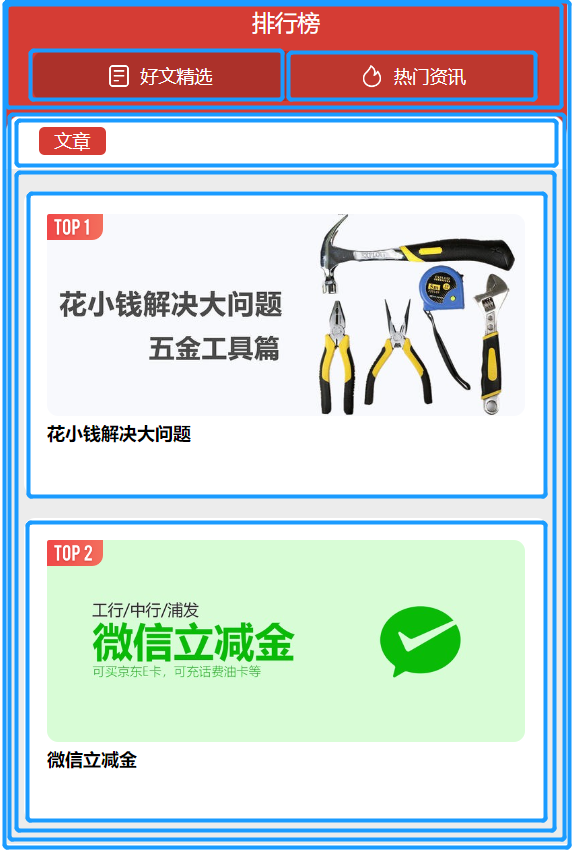

# 项目说明
===========================

## 环境依赖
vscode 1.77.0
 
===========================
 
## 功能说明
显示一个广告页面

===========================

## 布局思路
页面分为上下两部分 
1. 上部分：排行榜和好文精选、热门资讯选择栏
    - 好文精选和热门资讯选择栏中，分为左图片和右文字
2. 下部分：文章选择栏和排行榜内容
    - 在文章选择栏中存在一个“文章”小盒子
    - 在排行榜内容中存在两个小盒子，用于存放top1和top2文章内容
3. 框架示意图如下： 

===========================

## 遇到的问题及解决方案
1. padding和margin如何使用更加合理，例如在内容top1的盒子中，他与边框存在一定的距离，又与盒子内部存在一定的距离，此时就需要利用margin撑开盒子外边框和padding撑开盒子内边框。
2. 在实际中存在着许多圆角盒子，要使用 border-radius进行设计
3. background背景色的设计，在上部分与下部分的连接部分，由于下部分的top-left(right)为圆角，其露出来的红色应该使用父盒子的背景色来显示

===========================

## 项目链接
<https://git.wpsit.cn/cug-2023-web-tasks/yangyikai/src/master/week02/work>